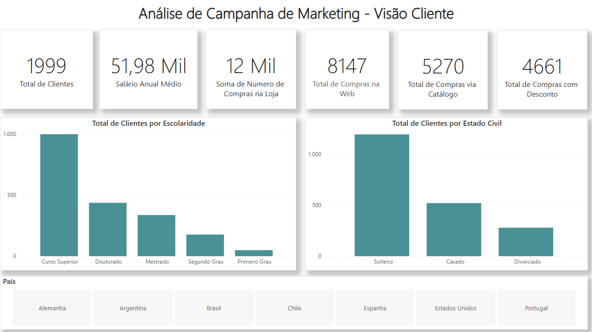
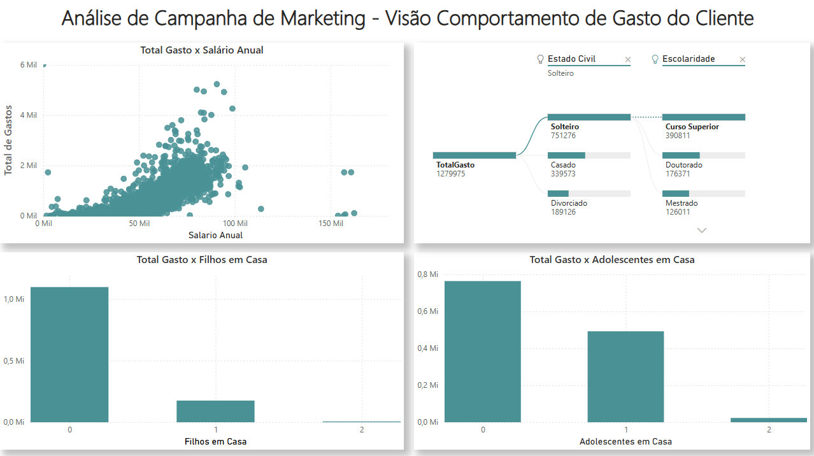
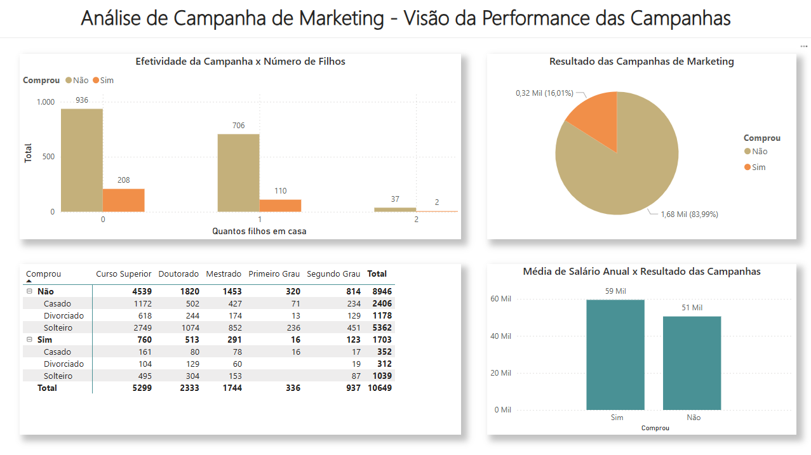

# 📊 Relatório de Análise de Campanha de Marketing — Power BI

## 📌 Visão Geral do Projeto
Este projeto utiliza **Business Intelligence (Power BI)** para analisar uma **campanha de marketing** sob três perspectivas: **perfil do cliente**, **comportamento de gasto** e **performance das campanhas**.

O objetivo é transformar dados em **insights acionáveis** para apoiar decisões de segmentação e otimização de campanhas, reduzindo achismos.

A análise foi estruturada para responder a três perguntas centrais de negócio:

- **Quem é o cliente e como está distribuído?**  
  Perfil por escolaridade, estado civil e país.

- **Como o cliente gasta e o que influencia esse gasto?**  
  Relação entre salário anual, gasto total e composição familiar.

- **As campanhas estão performando bem? Para quais perfis?**  
  Comparação entre “Comprou: Sim/Não” por segmentos.

---

## 📊 Dataset
- **Fonte:** Base disponibilizada no curso da **Data Science Academy (DSA)**
- **Contexto:** cenário **fictício** de campanha de marketing com dados de clientes, compras e resultado de campanhas.

O dataset contém informações como:
- Perfil do cliente (ex.: **Escolaridade, Estado Civil, País**)
- Variáveis financeiras (ex.: **Salário Anual**)
- Compras por canal (**Loja, Web, Catálogo**)
- Compras com desconto
- Composição familiar (**Filhos em casa, Adolescentes em casa**)
- Resultado de campanha (**Comprou: Sim/Não**)

---

## 🎯 Objetivo do Projeto
Construir um dashboard que permita:
- leitura rápida de KPIs e distribuição de clientes
- análise de padrões de gasto e fatores associados
- avaliação de performance de campanhas por segmento
- suporte a decisões estratégicas para campanhas futuras

---

## 🔍 Principais Insights
- A base é majoritariamente composta por clientes com **Curso Superior**.
- O público **Solteiro** representa o maior volume de clientes.
- Existe uma tendência de aumento de gasto conforme o **salário anual** aumenta, com presença de **outliers**.
- O gasto total se concentra principalmente em clientes com **0 filhos** em casa.
- A maior parte dos clientes está no grupo **“Não comprou”**, sugerindo espaço para otimização de segmentação e abordagem.

---

## 🛠 Ferramentas Utilizadas
- Power BI
- Power Query (ETL e tratamento)
- DAX (medidas e KPIs)

---

## 🖼️ Dashboard

### Link do Dashboard:
https://app.powerbi.com/view?r=eyJrIjoiYThjMzM3ZWYtOTFiYS00MWY4LTg0ZTEtNWZlODIwYjc4NzcyIiwidCI6Ijk4YjAyZTQ5LWU1NzEtNGZjYi1hODBjLTBiMTA3Y2E0YzdkMCJ9

### 1) Visão Cliente

### 2) Visão Comportamento de Gasto do Cliente

### 3) Visão da Performance das Campanhas

---
## 📎 Relatório em PDF
- Versão exportada do dashboard: [dashboard-marketing.pdf](assets/pdf/dashboard-marketing.pdf)

- ---

## 📌 Considerações Finais
Este projeto foi desenvolvido com foco em **visualização clara**, **pensamento analítico** e **comunicação de insights**, simulando um cenário real de BI aplicado ao marketing para apoiar decisões estratégicas.

---

## 👤 Autor
**Felipe Vilela**  
- LinkedIn: https://www.linkedin.com/in/felipe-vilela-594372362/
